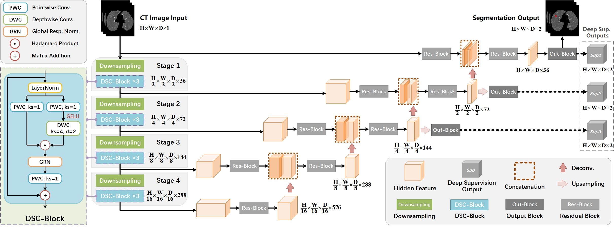

# ConvUNET (IEEE BIBM 2023)

Official Pytorch implementation of ConvUNET, from the following paper:

**ConvUNET: a Novel Depthwise Separable ConvNet for Lung Nodule Segmentation.**

[BIBM 2023](https://bidma.cpsc.ucalgary.ca/IEEE-BIBM-2023/) (Accepted at 13 Oct. 2023, [Regular Paper](https://ieeexplore.ieee.org/document/10385928))

[Xinkai Tang](https://xinkai-tang.github.io), Feng Liu, Ruoshan Kong, Fei Luo, *et al.*

School of Computer Science, Wuhan University, China


## Introduction



We propose a lightweight depthwise separable convolutional network named ConvUNET, which consists of a Transformer-like encoder and a ConvNet-based decoder.
Compared with some Transformer-based models (e.g., SwinUNETR) and ConvNeXt-based models (e.g., 3D UX-Net), our model has the advantages of fewer parameters, faster inference speed, and higher accuracy. 


## Segmentation Results
### Performance on LUNA-16 Dataset
|            Models             | Params(M) | GFLOPs |  DSC(\%)  |  SEN(\%)  |  PPV(\%)  |
| :---------------------------: | :-------: | :----: | :-------: | :-------: | :-------: |
|   UNETR (Hatamizadeh, 2021)   |   92.8    |  82.6  |   86.32   |   87.41   |   88.08   |
| SwinUNETR (Hatamizadeh, 2022) |   62.2    | 328.4  |   88.41   |   89.67   |   89.14   |
|    UNETR++ (Shaker, 2023)     |   53.5    |  48.0  |   88.42   |   89.57   |   89.08   |
|    ConvNeXt V1 (Liu, 2022)    |   31.9    |  89.3  |   87.46   |   88.12   |   89.17   |
|    ConvNeXt V2 (Woo, 2023)    |   31.9    |  89.3  |   87.59   |   88.38   |   88.92   |
|     3D UX-Net (Lee, 2023)     |   53.0    | 639.4  |   88.55   |   90.10   |   88.93   |
|   **ConvUNET (Ours, 2023)**   |   32.6    | 265.1  | **88.90** | **90.13** | **89.49** |

### Performance on LNDb-19 Dataset
|            Models             | Params(M) | GFLOPs |  DSC(\%)  |  SEN(\%)  |  PPV(\%)  |
| :---------------------------: | :-------: | :----: | :-------: | :-------: | :-------: |
|   UNETR (Hatamizadeh, 2021)   |   92.8    |  82.6  |   80.42   |   82.04   |   85.13   |
| SwinUNETR (Hatamizadeh, 2022) |   62.2    | 328.4  |   83.65   | **85.22** |   86.48   |
|    UNETR++ (Shaker, 2023)     |   53.5    |  48.0  |   83.34   |   84.33   |   85.49   |
|    ConvNeXt V1 (Liu, 2022)    |   31.9    |  89.3  |   81.05   |   82.37   |   85.42   |
|    ConvNeXt V2 (Woo, 2023)    |   31.9    |  89.3  |   81.10   |   82.62   |   85.05   |
|     3D UX-Net (Lee, 2023)     |   53.0    | 639.4  |   83.71   |   85.16   |   86.66   |
|   **ConvUNET (Ours, 2023)**   |   32.6    | 265.1  | **84.16** |   85.15   | **87.29** |


## Acknowledgement
This work is supported by National Natural Science Foundation of China (NSFC No.62172309).


## Citation 
If you find this repository helpful, please consider citing:
```
@inproceedings{tang2023convunet,
  title={ConvUNET: a Novel Depthwise Separable ConvNet for Lung Nodule Segmentation},
  author={Tang, Xinkai and Liu, Feng and Kong, Ruoshan and Luo, Fei and Huang, Wencai and Zou, Jiani},
  booktitle={2023 IEEE International Conference on Bioinformatics and Biomedicine (BIBM)},
  pages={1443--1450},
  year={2023},
  organization={IEEE}
}
```
